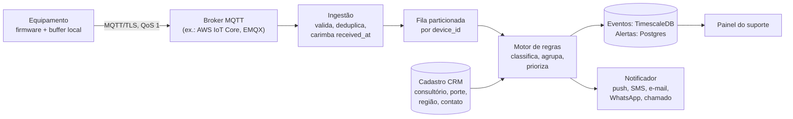

# Telemetria de equipamentos odontológicos · Desafio 02

Protótipo do Hackathon Alliage 2026. O equipamento manda logs, o servidor classifica cada evento em **erro, aviso ou ruído**, transforma o que importa em **alertas priorizados** e avisa **quem precisa agir**, para o suporte saber do problema antes de o cliente ligar.

> **Tudo aqui é simulado.** Frota, consultórios, logs e falhas foram gerados por nós (`simulator.py`). Os códigos de evento, limites e ações sugeridas são ilustrativos e precisam ser validados com o firmware e o suporte da Alliage.

## Como rodar

```bash
pip install -r requirements.txt   # streamlit e pandas (só a tela precisa deles)
python run.py                     # simula (se preciso), classifica, alerta, avalia e imprime o resumo
streamlit run dashboard.py        # abre a tela de alertas no navegador
```

`python run.py` funciona só com Python 3.9+ (sem bibliotecas externas) e imprime o fluxo ponta a ponta no terminal: serve de plano B se a tela falhar na apresentação. Mesma seed, mesmos logs.

| Arquivo | O que faz |
|---|---|
| `catalog.py` | Catálogo de códigos, categorias, regras, prioridades, fluxo de notificação e ações sugeridas. É o único arquivo que o suporte precisa editar. |
| `simulator.py` | Gera a frota e os logs com falhas injetadas, quedas de conexão, duplicatas e armadilhas. Escreve o gabarito. |
| `engine.py` | Motor: valida, deduplica, classifica, agrupa, escala e notifica. |
| `evaluate.py` | Compara os alertas com o gabarito: recall, precisão, antecedência, funil. |
| `run.py` | Roda tudo e salva `output/alerts.json`, `output/notifications.json`, `output/metrics.json`. |
| `dashboard.py` | Tela: alertas agora, cenário do pitch, métricas, log ponta a ponta, regras. |
| `data/` | Logs de exemplo (`events.jsonl`), cadastro da frota (`fleet.json`) e gabarito (`ground_truth.json`). |

## Arquitetura



| Componente | No protótipo | Em produção |
|---|---|---|
| Equipamento | `simulator.py` gera eventos, buffer e reenvio | firmware com fila em memória não volátil |
| Transporte | arquivo `events.jsonl` na ordem de chegada | MQTT sobre TLS, certificado por equipamento |
| Ingestão e motor | `engine.py`, um processo | várias cópias, uma partição de `device_id` cada |
| Armazenamento | memória + `output/*.json` | TimescaleDB (eventos) e Postgres (alertas) |
| Notificação | registrada em `notifications.json` | push/SMS/e-mail/WhatsApp + abertura de chamado |
| Painel | Streamlit | web do suporte |

**Escala.** Todo o estado das regras é por equipamento, então o fluxo divide por `device_id` sem coordenação. Na simulação, cada equipamento gera cerca de 35 mensagens por dia de uso: 10 mil equipamentos dão ~350 mil mensagens/dia, uns 10 por segundo em média, com pico às 8 h e nas reconexões. Um único processo Python do protótipo processou **~124 mil mensagens/s** (37.545 em 0,30 s num notebook; teste maior: `python run.py --clinicas 300 --dias 5 --dados carga --sem-comparacao`).

## Protocolo e formato do log

- **Canal:** MQTT sobre TLS (porta 8883), QoS 1, tópico `alliage/telemetria/v1/{modelo}/{device_id}/eventos`. Onde o equipamento não tem rede própria, um software gateway no computador do consultório faz a ponte.
- **Uma mensagem por evento** (ou lote de até 50 na reconexão):

```json
{"v": 1, "device_id": "CAD-0036", "model": "C-100", "fw": "3.1.0", "seq": 76624,
 "ts": "2026-09-04T17:46:32-03:00", "code": "CHR_AIR_PRESSURE_LOW", "lvl": "WARN",
 "value": 5.5, "unit": "bar"}
```

| Campo | Significado |
|---|---|
| `v` | versão do formato |
| `device_id`, `model`, `fw` | quem mandou e com qual firmware |
| `seq` | contador do equipamento, nunca repete: detecta duplicata e perda |
| `ts` | quando o evento aconteceu (relógio do equipamento, sincronizado por NTP) |
| `code` | código do catálogo |
| `lvl` | nível que o firmware atribui; a classificação final é do servidor |
| `value`, `unit` | medida, quando existe |
| `received_at` | **carimbado pelo servidor** na chegada (aparece em `events.jsonl`) |

**Sem conexão:** o equipamento continua funcionando e guarda os eventos numa fila local (ex.: 7 dias). Na reconexão, reenvia em ordem e só apaga o que o broker confirmou. Se a fila encher, descarta ruído primeiro e nunca erro. O servidor usa `ts` para as janelas das regras e `received_at` para prazos e antecedência. Como QoS 1 pode entregar duas vezes, o servidor descarta repetidos pelo par `device_id + seq`; um salto no `seq` indica mensagem perdida.

**Ligado, desligado ou sem sinal:** o equipamento manda `POWER_ON`, `POWER_OFF` e um sinal de vida a cada 60 min. Desligou normalmente, não é alerta. Ligado e calado há 2 h aparece como "sem sinal" no painel.

## Categorias

| Categoria | Critério | Consequência |
|---|---|---|
| **ERRO** | O equipamento parou ou está impedido de atender. | Alerta **P1** na hora. |
| **AVISO** | Fora da faixa recomendada, mas ainda funciona; pode anteceder um erro. | Isolado: observação **P3**, só no painel. Repetido: alerta **P2**. |
| **RUÍDO** | Operação normal ou evento esperado (liga/desliga, sinal de vida, exame concluído, retransmissão isolada). | Só armazenado. Se formar padrão, vira AVISO. |

## Regras de alerta

| Regra | Quando | Resultado |
|---|---|---|
| R0 | Evento AVISO que não completa nenhum padrão | Observação P3 |
| R1 | Qualquer evento ERRO | P1 · falha ativa |
| R2 | ≥ 3 `CHR_AIR_PRESSURE_LOW` do mesmo equipamento com `ts` numa janela de 24 h | P2 · compressor perdendo rendimento |
| R3 | ≥ 4 `PAN_TUBE_TEMP_HIGH` em 24 h | P2 · arrefecimento do tubo perdendo eficiência |
| R4 | ≥ 15 `CHR_PEDAL_COMM_RETRY` em 2 h (ruído que vira padrão) | P2 · comunicação do pedal instável |
| R5 | ≥ 10 `PAN_SENSOR_COMM_RETRY` em 4 h | P2 · conexão do sensor instável |
| R6 | Média móvel exponencial (α = 0,1) da corrente de `CHR_MOVE_CYCLE` acima do normal **da própria cadeira** + max(5σ, 0,25 A); o normal é aprendido nos primeiros 60 movimentos | P2 · desvio de comportamento do motor |

**Exemplo sem ambiguidade (R2):** para cada evento `CHR_AIR_PRESSURE_LOW` recebido, conte os eventos com o mesmo `code` e o mesmo `device_id` cujo `ts` esteja em `[ts − 24 h, ts]`. Se a contagem for ≥ 3, abra um alerta P2 da família AR para o equipamento; se já houver alerta aberto dessa família, escale-o para P2 (ou apenas agrupe, se já for P2 ou P1).

**Agrupamento:** existe no máximo um alerta aberto por equipamento e família (compressor, motor, pedal, tubo, sensor, gerador). Ocorrências novas somam nele; se o quadro piora, o mesmo alerta sobe de P3 para P2 e para P1.
**Tempo de silêncio:** lembrete só se o problema continuar depois de 4 h (P1) ou 24 h (P2).
**Encerramento:** após 8 h de **uso** sem nova ocorrência. Noite, domingo e feriado não contam, porque o equipamento estava desligado. Em produção, o técnico também encerra pelo chamado.

## Prioridade e fluxo de notificação

`score = base da faixa (P1 300, P2 200, P3 100) + pacientes/dia que dependem do equipamento`. O painel mostra primeiro o que parou, depois o que vai parar, depois o que merece olhar; dentro de cada faixa, quem tem mais pacientes em risco.

| Prioridade | Quem | Canal | Prazo | O que acontece |
|---|---|---|---|---|
| 🔴 P1 · agir agora | Técnico de plantão da região | push no app + SMS | ligar em até 30 min | Chamado aberto automaticamente; sem confirmação em 30 min, escala para a coordenação; consultório recebe WhatsApp dizendo que o suporte já está cuidando. |
| 🟠 P2 · agir hoje | Fila do suporte técnico | painel + e-mail | contato em até 1 dia útil | Analista liga e decide entre orientação remota e visita preventiva. |
| 🟡 P3 · observar | ninguém | só painel | resumo diário | Sobe para P2 sozinho se repetir. |

Cada notificação leva o consultório, o equipamento, o que foi visto e uma **ação sugerida** por família e prioridade (ver `ACOES` em `catalog.py`).

## Como os logs de exemplo foram gerados

`simulator.py`, seed 42: 30 consultórios fictícios no interior de SP (pequenos, médios e grandes), 89 cadeiras e 19 panorâmicos, de 01/09 a 14/09/2026, com domingo fechado, meio expediente em alguns sábados e o feriado de 7 de setembro. São 37.545 mensagens.

- **24 falhas com data marcada:** 20 com sinais precursores (compressor, motor, pedal e sensor com mau contato, arrefecimento do tubo) e 4 súbitas (pedal e gerador). O cliente "liga" 15 a 60 min depois que o equipamento para.
- **17 quedas de conexão** de 1 a 20 h, com reenvio e duplicatas. Duas são testes de propósito: uma falha súbita no meio da queda e uma queda no meio de uma degradação.
- **Armadilhas**, situações que parecem defeito: limpeza do consultório que desconecta o pedal, pedal com retransmissões espalhadas pelo dia, cadeiras cujo normal de corrente já é alto, avisos isolados de pressão ao ligar o compressor, panorâmicos muito usados que esquentam de vez em quando.

O motor nunca lê o gabarito. Ele só é usado em `evaluate.py`.

## Resultados (seed 42)

| Métrica | Valor |
|---|---|
| Falhas avisadas antes da ligação do cliente | **23 de 24** (96%) |
| Falhas avisadas antes de o equipamento parar | **18 de 24** (18 das 20 que tinham sinais) |
| Antecedência mediana, falhas com sinais | **41 h** |
| Falhas súbitas | alerta chega em mediana **48 min** antes da ligação |
| Precisão das notificações (P1 + P2) | **93%**: 2 falsos alarmes em 27 alertas que acionaram alguém |
| Notificações | **95**, contra 965 se cada aviso ou erro virasse uma notificação |

**Limiar fixo contra desvio de cada cadeira (5 falhas de motor, mesmos logs):**

| Regra | Avisadas antes de travar | Antecedência mediana | Falsos alarmes |
|---|---|---|---|
| Limiar fixo 3,3 A | 4/5 | 24 h | 12 |
| Limiar fixo 3,6 A | 5/5 | 24 h | 0 |
| Desvio do normal de cada cadeira (R6) | 5/5 | **42 h** | **0** |

**O que deu errado, e por quê:**
- **Os 2 falsos alarmes** são as limpezas do pedal (R4 com exatamente 15 retransmissões em 2 h). Correção possível: o firmware mandar um evento de "modo limpeza", ou exigir rajadas em dois dias diferentes.
- **1 falha avisada depois da ligação:** o gerador parou durante uma queda de conexão; o alerta só chegou quando o equipamento reconectou. Nenhuma regra resolve isso, só redundância de conexão.
- **2 compressores só foram vistos quando pararam:** a degradação começou numa sexta, antes do domingo e do feriado; com o consultório fechado, os avisos nunca somaram 3 em 24 h. Próximo passo: contar a janela em horas de uso, não em horas de relógio.

## Limitações

- Números medidos contra falhas que nós mesmos desenhamos: validam a lógica, não o desempenho em campo. O próximo passo é rodar sobre logs reais e o histórico de chamados.
- Códigos, limites e ações são inventados; precisam do firmware e da base de conhecimento do suporte.
- Confirmação de leitura, escalonamento para a coordenação e envio real de mensagens estão descritos, não implementados.
- O normal de cada cadeira é aprendido uma vez; em produção, deve ser reaprendido após cada manutenção.

## Próximos passos

1. Adaptar a leitura para os logs reais da Alliage e medir contra o histórico de chamados.
2. Janelas contadas em horas de uso.
3. Ajustar limites por modelo com os dados reais.
4. Integrar com o sistema de chamados e com o app do técnico.

## Checklist de entrega

| Item | Onde |
|---|---|
| Arquitetura com componentes nomeados | seção Arquitetura |
| Protocolo e formato do log com exemplo | seção Protocolo e `data/events.jsonl` |
| Categorias erro, aviso, ruído com critério | seção Categorias e `catalog.py` |
| Regra implementável | seção Regras (R2 por extenso) e `engine.py` |
| Logs de exemplo com falhas simuladas e como foram gerados | `data/` e seção Como os logs foram gerados |
| Números: falhas detectadas e alarmes falsos | seção Resultados, `output/metrics.json`, aba Métricas |
| Tela funcionando | `streamlit run dashboard.py` (testar no notebook da apresentação) |
| Fluxo de notificação | seção Prioridade e fluxo de notificação |
